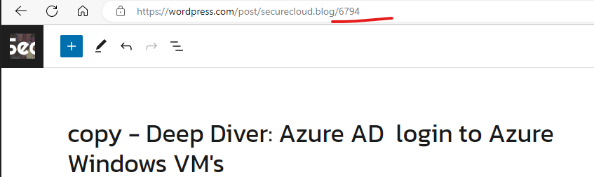
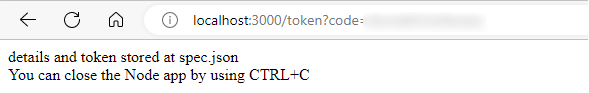

# Intro

A short project to automatically update MVPID in Wordpress posts.


## WP Updater for docs creatorID
- Updates single post: ``node ./main.js --postId=6794 --mvpId=AZ-MVP-5003833`` 
- MVPID is something you get from your MVP program manager, in my case it is our fantastic Community Program Manager [Tina Stenderup-Larsen](https://twitter.com/TinaStenderup)
-  You can find the postId by viewing the post draft
  
  

## Disclaimer 
- Test this project on draft posts first!
- The WP API will always change the blog format to "classic" (although no visual changes were found, the editing mode changes) - you can change it back to "blocks" from the WP editing UI.
- The initial code for this project was written a long time ago (in 2020) and some parts have been refactored. There are some redundant parts, but it still works as intended.
- The code and instructions provided in this project are "AS IS" with no dependencies and do not confer any rights.


### Limitations
- Due the API design of the automatic update of the converts the post to 'classic' WP.
- The tool works correctly only on posts that dont contain MVP ID's. I was too lazy, to first exclude the matched content with MVPIDs

#### before doing anything 
- Have NodeJS installed
  
- Have draft blogs to test the functionality


- get the API key, and blog ID from https://developer.wordpress.com/apps/ 


- [access apps in worpress.com](https://developer.wordpress.com/apps/)


## how-to
setup config.js in [config](config/_config.js) by renaming it config.js (previously _config.js)
- update secret and client_id, and "blog:"

```javascript 
module.exports={
        client_id:"70557",
        redirect_uri:"http://localhost:3000/token",
        blog:"securecloud",
        client_secret: "",
}
```


## Usage


### First time
```sh
npm install
```

### Store the access token (open the browser link)
```
node app.js
```

  


### Run 

Run the command  ``node ./main.js --postId=6794 --mvpId=AZ-MVP-5003833``


